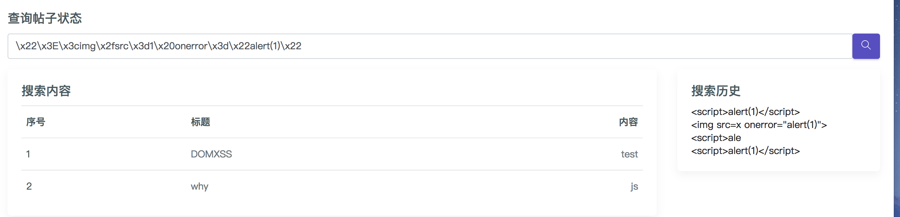
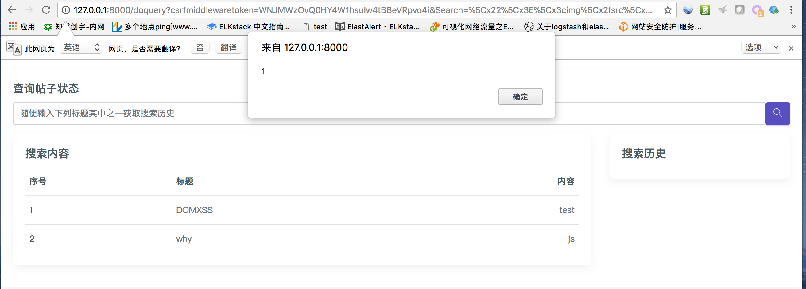

# DOM型XSS，经典的编码解析问题

## 漏洞出处

WooYun-2012-15530

gainover发现的腾讯的DOM型XSS漏洞，本实例基于试图尽可能还原此漏洞的漏洞业务场景。


## 复现漏洞

运行测试环境：

```
docker-compose up -d
```

访问`http://your-ip:8000/`，

登录页面，输入用户名密码：

```
用户名：admin
密码：admin
```


如图所示，简单的`<script>`并不能触发相应的xss漏洞

使用漏洞编码：

`\x22\x3E\x3cimg\x2fsrc\x3d1\x20onerror\x3d\x22alert(1)\x22`

可触发XSS






